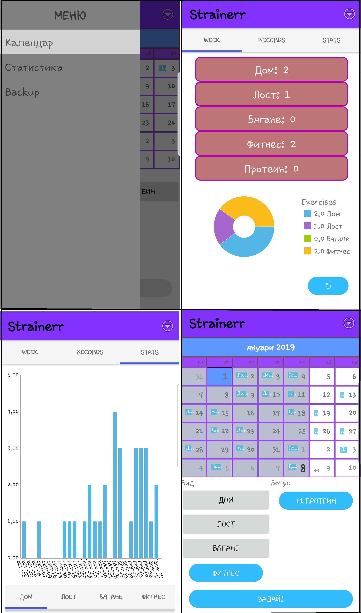

# NativeScript(with Angular) 

#### Description:
My personal app for workouts.With it you can save your workouts(have different categories) and when you consume protein in calendar and watch your progress.This app show how many times you train every week in appropriate charts. 

I use  UI Components:
 * Chart
 * Calendar
 * SideDrawer
 

